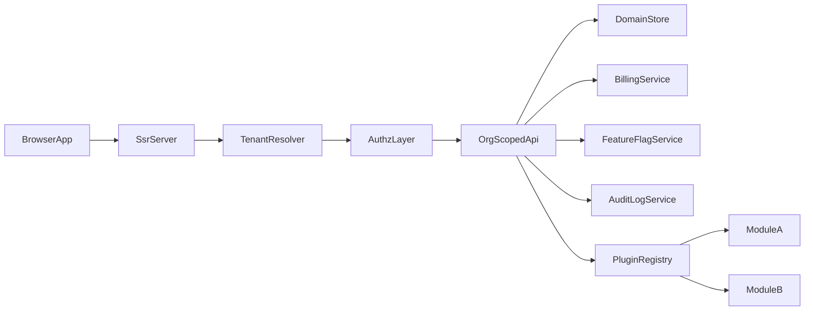

# Multi-tenant SaaS Admin System Plan

## Scope and Target Outcomes

- Build a tenant-isolated admin platform with organizations, scoped roles, billing state, feature flags, audit logs, and plugin-like modules.
- Preserve current SSR + API + client-state layering while introducing explicit tenant boundaries at every layer.
- Ship with test coverage (unit, smoke, e2e), security controls, and updated architecture/security docs.

## Current Foundation To Reuse

- Shared domain contracts in [`src/commerce/model.ts`](../src/commerce/model.ts).
- Central server SSR/auth/routing in [`server/index.ts`](../server/index.ts).
- In-memory domain data store in [`server/store.ts`](../server/store.ts).
- Client-side app state and API edges in [`src/commerce/state.ts`](../src/commerce/state.ts) and [`src/commerce/api.ts`](../src/commerce/api.ts).
- Admin UI surface in [`src/components/CommercePages.tsx`](../src/components/CommercePages.tsx).

## Architecture Blueprint

- Tenant context is mandatory for all protected reads/writes.
- Authorization enforces `(orgId + role + entitlement + feature flag)` before every admin action.
- Plugin modules are isolated by contract and registered through a server-side registry.

## Implementation Phases

### 1) Tenant and Organization Domain Model

- Extend contracts in [`src/commerce/model.ts`](../src/commerce/model.ts):
  - `Organization`, `OrganizationMember`, `RoleAssignment`, `BillingPlan`, `FeatureFlagSet`, `AuditEntry`, `AdminModuleDescriptor`.
  - Add `orgId` to session payload and all admin-scoped entities.
- Partition store structures in [`server/store.ts`](../server/store.ts) by org.
- Introduce explicit org-scoped query/mutation APIs (no implicit global fallbacks).

### 2) Access Control and Route Exposure

- In [`server/index.ts`](../server/index.ts):
  - Add tenant resolution (session + request context).
  - Replace role-only guards with org-scoped authorization middleware.
  - Enforce safe default exposure for admin routes (`403` on org mismatch).
- In [`src/commerce/api.ts`](../src/commerce/api.ts), ensure all admin requests carry tenant context and reject missing org context.

### 3) Admin App Shell and Navigation

- In [`src/components/CommercePages.tsx`](../src/components/CommercePages.tsx) and [`src/App.tsx`](../src/App.tsx):
  - Add org-aware admin shell (org switcher, role badge, current plan/limits, module nav).
  - Gate menu items and actions by role + feature flags.
  - Keep app shell independent from module internals.

### 4) Billing, Feature Flags, Audit Logs

- Add billing state and plan entitlement checks in store/server boundaries.
- Add a feature flag evaluation layer (org-level + optional role overrides).
- Emit immutable audit events for admin mutations (actor, org, action, target, timestamp, metadata).
- Expose admin endpoints/pages for billing overview, feature controls, and audit history.

### 5) Plugin-like Module System

- Define module contract and registry primitives in shared model + server bootstrap.
- Module registration includes:
  - `moduleId`, `displayName`, required roles, required flags, route contributions.
- App shell renders only registered and authorized modules.
- Start with internal modules (Users, Billing, Flags, Audit) to validate extension model.

### 6) Scalability and Code Ownership Boundaries

- Boundaries:
  - `src/commerce/*`: shared typed contracts and state rules.
  - `server/*`: authoritative authz, tenant partitioning, audit writing, module registry.
  - `src/components/*`: presentational/admin shell composition.
- Introduce per-module server and UI entry points to prevent cross-module coupling.
- Document ownership model and extension rules in docs to support parallel team delivery.

### 7) Verification and Rollout

- Unit tests:
  - [`server/store.test.ts`](../server/store.test.ts) for tenant isolation and authz.
  - [`src/commerce/catalog.test.ts`](../src/commerce/catalog.test.ts) for org-scoped behavior where relevant.
- Smoke/UI tests:
  - [`src/App.smoke.test.tsx`](../src/App.smoke.test.tsx) and [`src/test/commerceTestState.ts`](../src/test/commerceTestState.ts).
- Browser e2e:
  - Extend [`e2e/run.mjs`](../e2e/run.mjs) with cross-tenant isolation and role/flag gating scenarios.
- Docs updates:
  - [`docs/architecture.md`](./architecture.md), [`docs/security-audit.md`](./security-audit.md), [`docs/roadmap.md`](./roadmap.md), [`docs/engineering-rules.md`](./engineering-rules.md).
- Verification path per delivery rules: lint, typecheck, tests, build, e2e.

## Definition of Done

- Every admin API and UI mutation is org-scoped and auditable.
- Unauthorized cross-tenant access is blocked by server middleware and covered by tests.
- Billing entitlements and feature flags control access to modules and actions.
- Module registry allows adding/removing admin modules without editing core shell routing logic.
- Documentation reflects architecture, security posture, and ownership rules.

## Implementation Status

- Completed:
  - Replaced the storefront with a SaaS admin-first SSR shell.
  - Replaced commerce contracts with platform contracts under `src/platform/*`.
  - Added multi-organization seeded sessions and org switching.
  - Added org-scoped member, billing, flag, audit, and plugin routes plus APIs.
  - Added module-registry-based navigation with server-enforced access checks.
  - Added unit, smoke, server, and browser coverage for the new product.
- Remaining roadmap ideas:
  - durable persistence
  - invite and provisioning flows
  - usage history and invoice artifacts
  - deeper module extraction for larger team ownership
